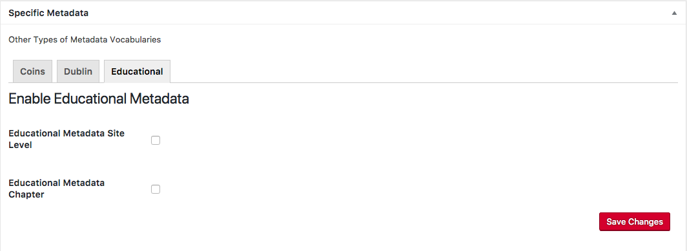
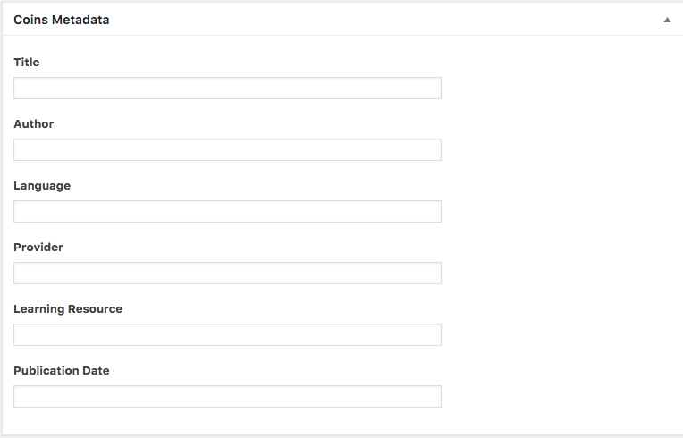
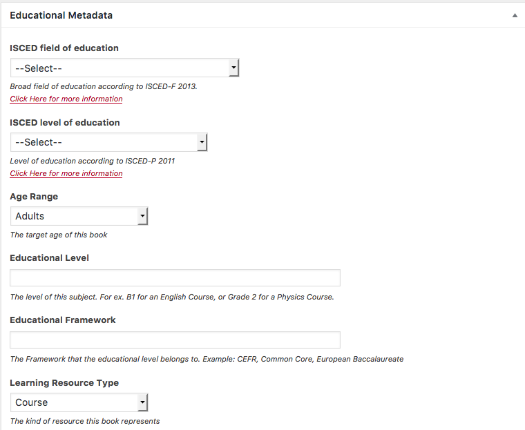
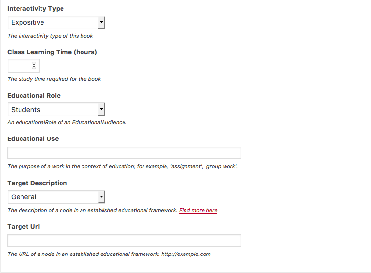

#### Specific metadata

Offer other types of specific Metadata vocabularies
* Coins
* Dublin Core
* Educational (LRMI)

Coins and Dublin Core have just one checkbox (for Site level or Home page activation) but Educational have two checkboxes. One for Site level and the second one for Post level

##### Coins

Is a method to embed bibliographic metadata on the homepage by going to its tab checking the checkbox and clicking Save Changes. As before, all metadata related to our homepage can be edited under the Tools tab by selecting Site Metadata (or Book info for PressBooks users).

##### Dublin Core

Is a small set of vocabulary terms that can be used to describe web resources on the homepage by going to its tab checking the checkbox and clicking Save Changes. As before, all metadata related to our homepage can be edited under the Tools tab by selecting Site Metadata (or Book info for PressBooks users).
The original set of 15 classic metadata terms, known as the Dublin Core Metadata Element Set.

    Title
    Creator
    Subject
    Description
    Publisher
    Contributor
    Date
    Type
    Format
    Identifier
    Source
    Language
    Relation
    Coverage
    Rights

###### Dublin Core Metadata Terms

The Dublin Core Metadata Initiative (DCMI) Metadata Terms is the current set of the Dublin Core vocabulary.[13] This set includes the fifteen terms of the Dublin Core Metadata Element Set (in italic), as well as the qualified terms. Each term has a unique URI in the namespace http://purl.org/dc/terms, and all are defined as RDF properties.

    abstract
    accessRights
    accrualMethod
    accrualPeriodicity
    accrualPolicy
    alternative
    audience
    available
    bibliographicCitation
    conformsTo
    *contributor*
    *coverage*
    created
    *creator*
    *date*
    dateAccepted
    dateCopyrighted
    dateSubmitted
    *description*
    educationLevel
    extent
    *format*
    hasFormat
    hasPart
    hasVersion
    *identifier*
    instructionalMethod
    isFormatOf
    isPartOf
    isReferencedBy
    isReplacedBy
    isRequiredBy
    issued
    isVersionOf
    *language*
    license
    mediator
    medium
    modified
    provenance
    *publisher*
    references
    *relation*
    replaces
    requires
    *rights*
    rightsHolder
    *source*
    spatial
    *subject*
    tableOfContents
    temporal
    *title*
    *type*
    valid

##### Educational Metadata (LRMI)

Is a method to embed educational metadata on the homepage or in the Post (chapter for PressBooks users) by going to its tab checking the checkbox and clicking Save Changes. As before, all metadata related to our homepage can be edited under the Tools tab by selecting Site Metadata (or Book info for PressBooks users) for Site level or in the Post (chapter) for Post level.

The [LRMI specification](http://dublincore.org/dcx/lrmi-terms/1.1) is a collection of classes and properties for markup and description of educational resources. The specification builds on the extensive vocabulary provided by Schema.org and other standards. [LRMI terms](http://dublincore.org/dcx/lrmi-terms/) not included in schema.org may nevertheless be used to augment and enrich Schema.org markup.

Index of Terms in the /lrmi-terms/ Namespace
  Classes
  AlignmentObject
  EducationalAudience
  Properties
  alignmentType
  educationalAlignment
  educationalFramework
  educationalRole
  educationalUse
  interactivityType
  isBasedOnUrl
  learningResourceType
  targetDescription
  targetName
  targetUrl
  timeRequired
  typicalAgeRange
  useRightsUrl

---

[Readme](/Readme.md)
